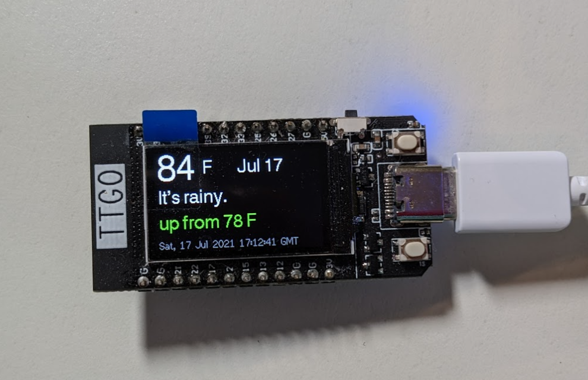

# Displays MozCast weather on a ESP32 board

Arduino C++ code. Apache 2 license. Uses [MozCast](https://moz.com/mozcast) data. 
This is Moz's unique interpretation of how Google's search results change. YMMV. 
This is just for fun. 

## Requirements

 *  ESP32 Lilypad TTGO with T-Display (can be adapted to others easily though)
    For example: https://s.click.aliexpress.com/e/_AaToZG 
    (currently $10-25; chips are a bit more expensive than they used to be)
    
 *  Libraries (all in Arduino too):
    * TFT_eSPI - https://github.com/Bodmer/TFT_eSPI
    * ESP_DoubleResetDetector - https://github.com/khoih-prog/ESP_DoubleResetDetector
    * ESP_WiFiManager - https://github.com/khoih-prog/ESP_WiFiManager

 
## Configuration

1. Edit TFT_eSPI User_Setup_Select.h:
 - add comment to //#include <User_Setup.h>
 - uncomment #include <User_Setups/Setup25_TTGO_T_Display.h> 

2. Install ESP32 boards in Arduino ( https://randomnerdtutorials.com/installing-the-esp32-board-in-arduino-ide-windows-instructions/ )

3. Select board in Arduino: ESP32 -> TTGO LoRa32-OLED V1 (others probably work too)

4. Compile & upload

## Usage

The device uses a [wifi-manager](https://github.com/khoih-prog/ESP_WiFiManager). 
On first run, it will create a local access point, where you can configure your wifi credentials. 
These credentials are stored in flash memory and reused on future connections.

If you want to change the credentials or use a different network, use the reset button twice within 10 seconds.
This will re-activate the local access point and let you make changes. 

## Misc

Photo of running device

### Sidenotes

* The time on the bottom is from the HTTP response headers and may vary depending on the server you get.
* The descriptive weather is just the filename of the icon used on the page.  
* Moz is probably a trademark. Maybe MozCast is too? I didn't see anything off-hand.
* Does not download or store any cookies from the MozCast servers. Your requests may be logged with your public IP address though.
* I don't think ESP_WiFiManager stores any cookies or keeps any analytics either, but it's not under my control.

