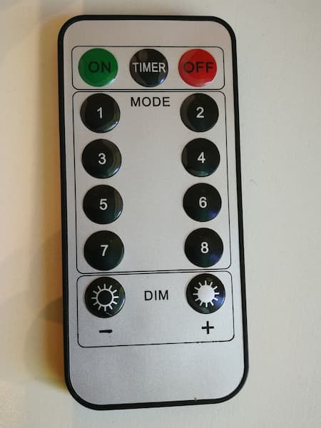
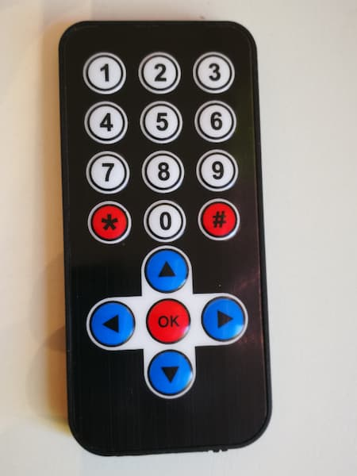
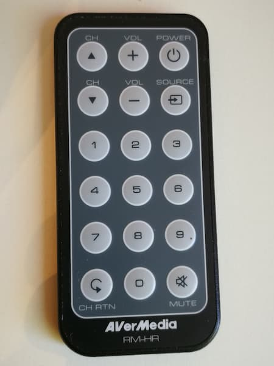

# Random collection of IR remotes with config files for WLED

Requires WLED v0.13+ (https://github.com/Aircoookie/WLED/releases).

## Get WLED 0.13 b2 or newer

To install, first check that you have a v0.13+ WLED installed.
Open the WLED URL for your device in a browser (usually something like http://wled-123ab/ ).
You can see the installed version in Config / Security & Updates.
If you need to update, go to (https://github.com/Aircoookie/WLED/releases) to find the appropriate WLED version for your device (usually either ..._ESP01.bin , ..._ESP32.bin, or ..._ESP8266.bin depending on your chip). 
Download the appropriate .bin file.
Now go to Config / Security & Updates / Manual OTA Update, choose your file, and upload it.

## Learn where to upload `ir.json`

go to your WLED URL + "/edit", for example, if your WLED URL is http://wled-123ab/ then go to http://wled-123ab/edit .

## 13-button chain-lights

[infos](13b-1/)

[On Aliexpress](https://s.click.aliexpress.com/e/_9gupoe)

## 17-button "ROAR" 

[infos](17b-1/)

[On Aliexpress](https://s.click.aliexpress.com/e/_AUo2ua)

## 18-button media

[infos](18b-1/)
