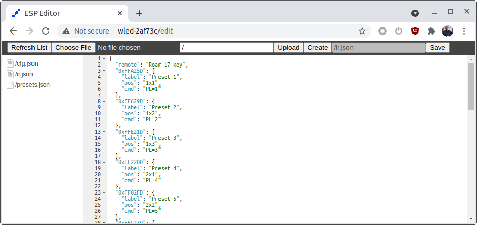
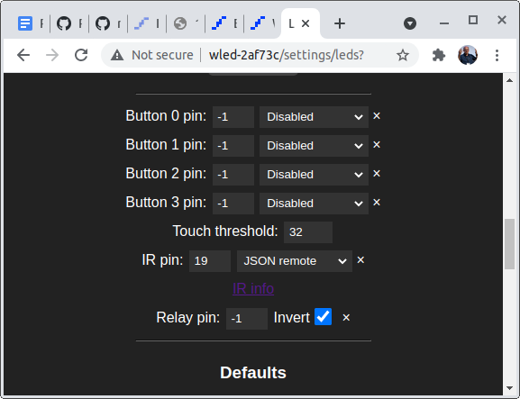

# Random collection of IR remotes with config files for WLED

Requires WLED v0.13 b2 or newer.

## Setup / How-To

### Get WLED 0.13 b2 or newer

To install, first check that you have a v0.13+ WLED installed.
Open the WLED URL for your device in a browser (usually something like http://wled-123ab/ ).
You can see the installed version in Config / Security & Updates.
If you need to update, go to https://github.com/Aircoookie/WLED/releases to find the appropriate WLED version for your device (usually either ..._ESP01.bin , ..._ESP32.bin, or ..._ESP8266.bin depending on your chip). 
Download the appropriate .bin file.
Now go to Config / Security & Updates / Manual OTA Update, choose your file, and upload it.

### Learn where to upload `ir.json`

Go to your WLED URL (usually something like http://wled-123ab/ ).
Change the URL in your browser to add "/edit", for example, http://wled-123ab/edit .
A file browser should be visible, usually with /cfg.json and /presets.json on the left.

The ir.json file is the one that gives the IR controller settings for WLED. 
Download one of the files from the appropriate remote control below. 
Now use `Choose File` to pick the file from your computer, and `Upload` to install it. 

### Set WLED to use your ir.json

Warning: This may change in the WLED UI over time. 
Click around until you find it :-). 

Go to Config / LED Preferences, and scroll down a bit. 
You should find a setting with "IR pin", where you need to specify the pin number of your IR receiver. 

Next to the pin number, you should have a drop-down for the type of remote.
Select 'JSON remote' there.
Click 'save' and be happy (or go to Config / Security & Updates / Reboot to restart).

## Devices

### 13-button chain-lights

[infos](13b-1/)

[On Aliexpress](https://s.click.aliexpress.com/e/_9gupoe)

### 17-button "ROAR" 

[infos](17b-1/)

[On Aliexpress](https://s.click.aliexpress.com/e/_AUo2ua)

### 18-button media

[infos](18b-1/)
